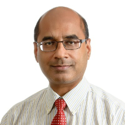
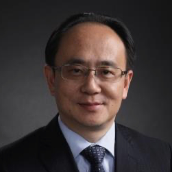
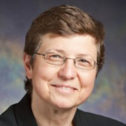
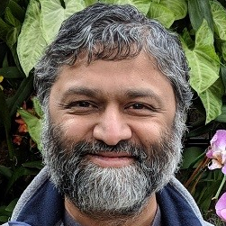

## Keynote 1
<!-- ### Presenter -->

    

        
    

    <!-- - **Title**: -->
    <h3>Mohan Kankanhalli</h3>
    <!-- - **Date**: -->
    <!-- - **Abstract**:  -->
    
School of Computing, National University of Singapore

    

        Mohan Kankanhalli is Provost's Chair Professor of Computer Science at the National University of Singapore (NUS). He is also the Dean of NUS School of Computing. Before becoming the Dean in July 2016, he was the NUS Vice Provost (Graduate Education) during 2014-2016 and Associate Provost during 2011-2013. Mohan obtained his BTech from IIT Kharagpur and MS & PhD from the Rensselaer Polytechnic Institute. Mohan’s research interests are in Multimedia Computing, Computer Vision, Information Security & Privacy and Image/Video Processing. He has made many contributions in the area of multimedia & vision – image and video understanding, data fusion, visual saliency as well as in multimedia security – content authentication and privacy, multi-camera surveillance.
    

    

        He directs N-CRiPT (NUS Centre for Research in Privacy Technologies) which conducts research on privacy on structured as well as unstructured (multimedia, sensors, IoT) data. N-CRiPT looks at privacy at both individual and organizational levels along the entire data life cycle. He is personally involved in privacy research related to images, video and social media as well as privacy risk management. N-CRiPT, which has been funded by Singapore’s National Research Foundation, works with many industry, government and academic partners. 
    

    

        Mohan is a Fellow of IEEE.
    

## Keynote 2
<!-- ### Presenter -->

    

        
    

    <!-- - **Title**: -->
    <h3>Yong Rui</h3>
    <!-- - **Date**: -->
    <!-- - **Abstract**:  -->
    
Lenovo Group

    

        Dr. Yong Rui is the Corporate CTO and Senior Vice President of Lenovo Group. He directs Lenovo’s technical strategies and R&D directions. Additionally, Dr. Rui leads the Lenovo Research organization that investigates intelligent devices, artificial intelligence, 5G, cloud and edge computing, and smart vertical solutions. Prior to joining Lenovo, Dr. Rui spent 18 years with Microsoft where he held various leadership roles in R&D strategy, basic research, technology incubation and product development, and most recently served as Deputy Managing Director of Microsoft Research Asia.
    

    

        A Fellow of ACM, IEEE, IAPR and SPIE, and a Foreign Member of Academia Europaea and Canadian Academy of Engineering, Dr. Rui is recognized as a leading expert in AI and multimedia analysis. He is a recipient of many awards, including the 2018 ACM SIGMM Technical Achievement Award, the 2017 IEEE SMC Society Andrew P. Sage Best Transactions Paper Award, the 2017 ACM TOMM Nicolas Georganas Best Paper Award, the 2016 IEEE Computer Society Edward J. McCluskey Technical Achievement Award, the 2016 IEEE Signal Processing Society Best Paper Award and the 2010 Most Cited Paper of the Decade Award from Journal of Visual Communication and Image Representation. He holds 70 issued patents, has published 4 books, 12 book chapters, and 200 refereed journal and conference papers. With over 30,000+ citations, and an h-Index of 82, his publications are among the most referenced.
    

    

        Dr. Rui is an Associate Editor of ACM Trans. on Multimedia Computing, Communication and Applications (TOMM)  (2007- ), and a founding Editor of International Journal of Multimedia Information Retrieval (2011- ). He was the Editor-in-Chief of IEEE MultiMedia magazine (2014-2017), and an Associate Editor of IEEE Access (2013-2016), IEEE Trans. on Multimedia (2004-2008), IEEE Trans. on Circuits and Systems for Video Technologies (2006-2010), ACM/Springer Multimedia Systems Journal (2004-2006), and International Journal of Multimedia Tools and Applications (2004-2006). He also served on the Advisory Board of IEEE Trans. on Automation Science and Engineering (2006-2016).
    

    

        Involved in many facets of the field, Dr. Rui is a member of numerous organizing and program committees for conferences including ACM Multimedia, ACM ICMR, IEEE ICME, SPIE ITCom, and ICPR. He is General Co-Chair of ACM Multimedia in 2009 and 2014, ACM ICMR in 2006 and 2012, and ICIMCS in 2010, and Program Co-Chair of ACM Multimedia in 2006, Pacific Rim Multimedia (PCM) in 2006, and IEEE ICME in 2009. He is on the Steering Committees of ACM Multimedia, ACM ICMR, IEEE ICME and PCM. He is an Executive Member of ACM SIGMM (2009-2010, 2013-2016), and the founding Chair of its China Chapter.
    

    

        Dr. Rui received his BS from Southeast University Summa cum laude, his MS from Tsinghua University, and his PhD from University of Illinois at Urbana-Champaign (UIUC). 
    

## Keynote 3
<!-- ### Presenter -->

    

        
    

    <!-- - **Title**: -->
    <h3>Klara Nahrstedt</h3>
    <!-- - **Date**: -->
    <!-- - **Abstract**:  -->
    
UIUC

    

        Klara Nahrstedt is the Ralph and Catherine Fisher Professor in the Department of Computer Science Department, and Direct of Coordinated Science Laboratory in the Grainger College of Engineering at the University of Illinois at Urbana-Champaign. Her research interests are directed towards tele-immersive systems, mixed reality video 360 systems, Internet-of-Things systems, and real-time security and privacy in cyber-physical systems such as power-grid. She is the co-author of multimedia books “Multimedia Computing, Communications and Applications”, published by Prentice Hall, and “Multimedia Systems”, published by Springer Verlag. She is the recipient of the IEEE Communication Society Leonard Abraham Award for Research Achievements, Humboldt Research Award, IEEE Computer Society Technical Achievement Award, ACM SIGMM Technical Achievement Award, TU Darmstadt Piloty Prize, and the Grainger College of Engineering Drucker Award. She served as the chair of the ACM SIGMM between 2007-2013, and co-chaired many conferences including ACM International Conference on Multimedia, IEEE Percom, ACM/IEEE IOTDI, IEEE SmartGridComm, and others. Klara Nahrstedt received her Diploma in Mathematics from Humboldt University zu Berlin in 1985, and PhD in Computer and Information Science from University of Pennsylvania in 1995. She is Fellow of ACM, IEEE and AAAS, and member of the German National Academy of Sciences (Leopoldina Society).
    

## Keynote 4: How to do Research for Fun and Profit
<!-- ### Presenter -->

    

        
    

    <!-- - **Title**: -->
    <h3>Divesh Srivastava</h3>
    <!-- - **Date**: -->
    <!-- - **Abstract**:  -->
    
AT&T Labs-Research

    

        Divesh Srivastava is the Head of Database Research at AT&T. He is a Fellow of the Association for Computing Machinery (ACM), the Vice President of the VLDB Endowment, co-chair of the ACM Publications Board, on the Board of Directors of the Computing Research Association (CRA), and an associate editor of the ACM Transactions on Data Science (TDS). He has served as the managing editor of the Proceedings of the VLDB Endowment (PVLDB), as associate editor of the ACM Transactions on Database Systems (TODS), and as associate Editor-in-Chief of the IEEE Transactions on Knowledge and Data Engineering (TKDE). He has presented keynote talks at several international conferences, and his research interests and publications span a variety of topics in data management. He received his Ph.D. from the University of Wisconsin, Madison, USA, and his Bachelor of Technology from the Indian Institute of Technology, Bombay, India.
    

