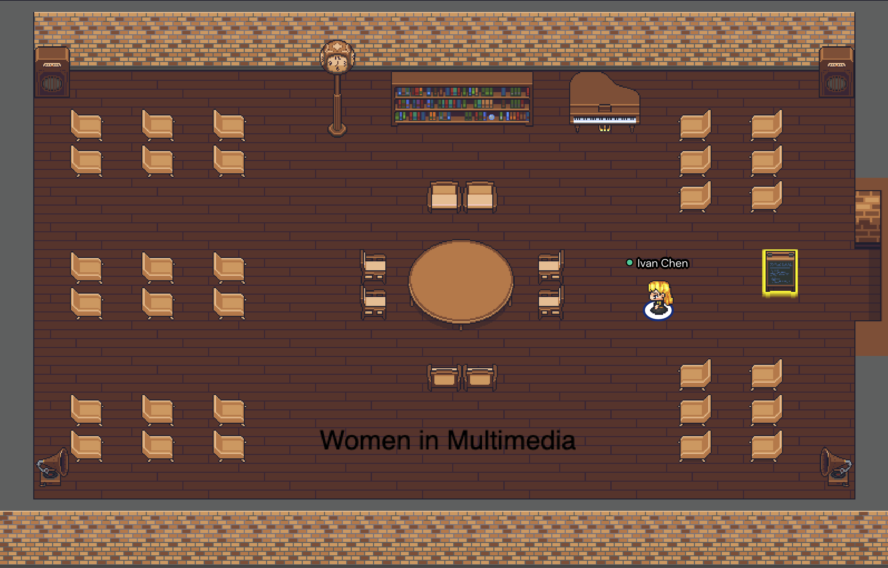
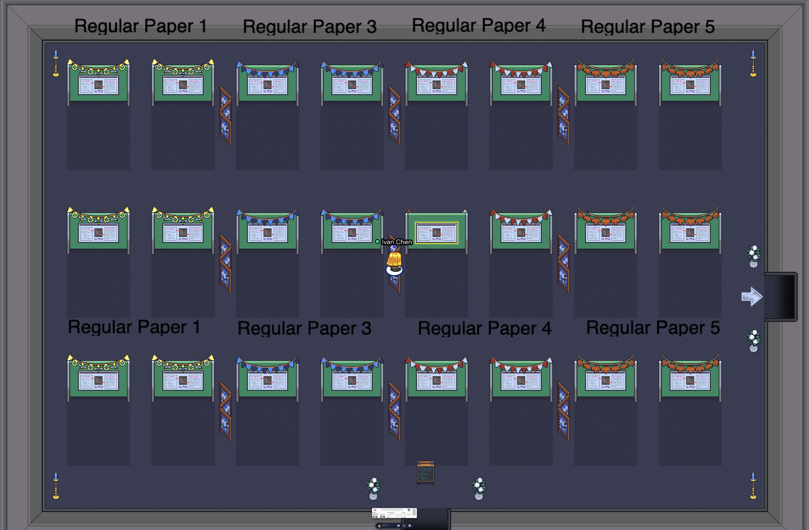
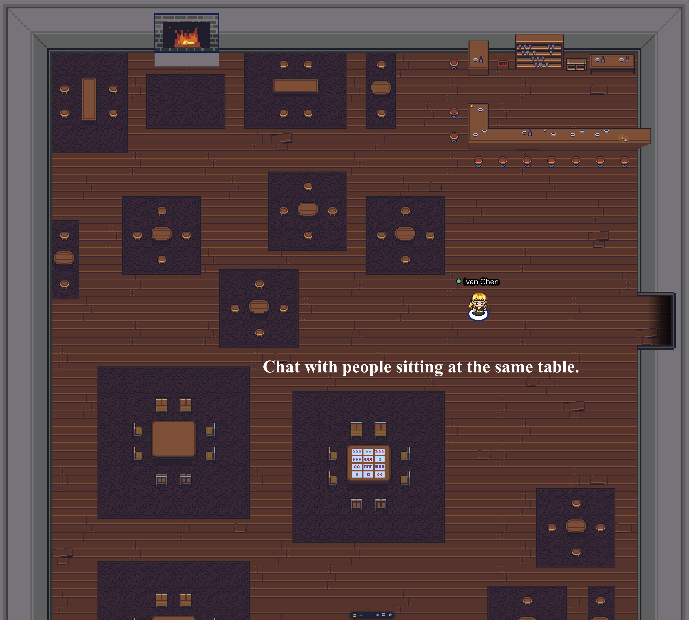
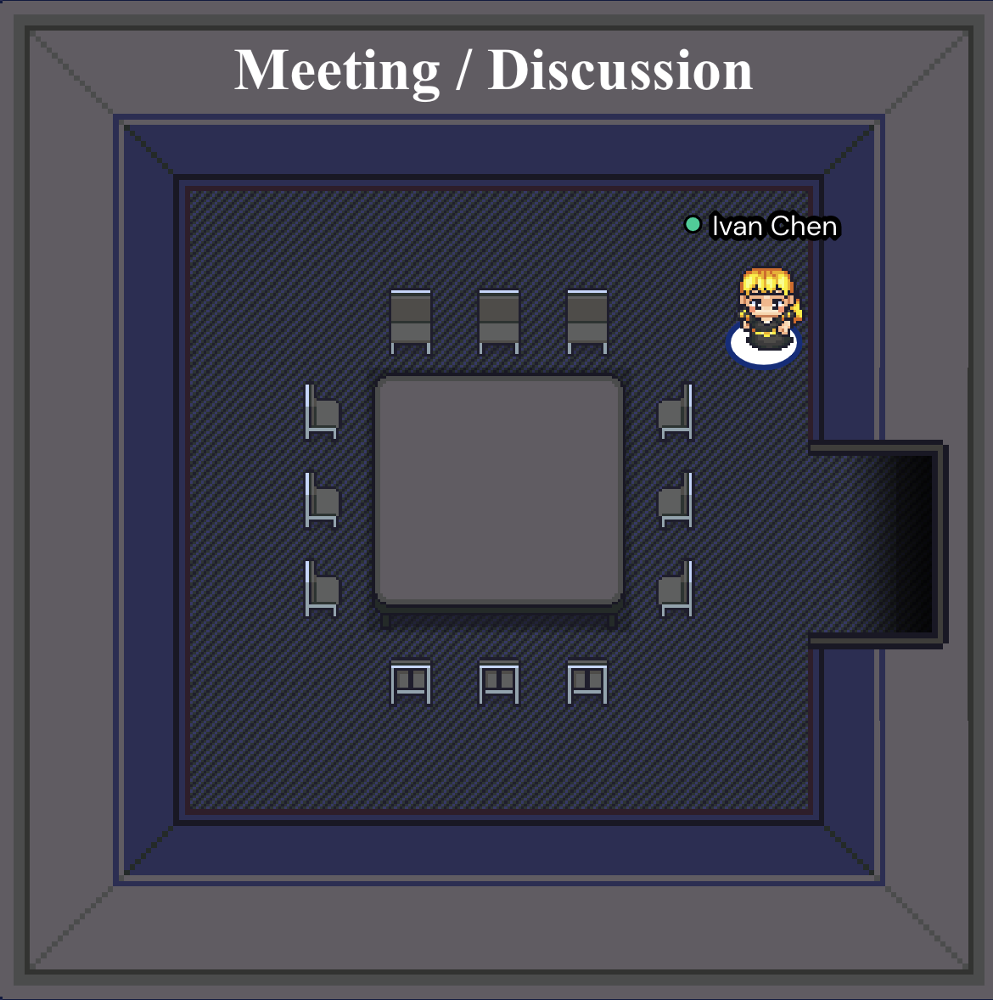

Welcome to ACM Multimedia Asia Gather.Town! 

## Main Entry

When you enter the town, you are supposed to be sitting here.

    

## Exhibition Hall
The tracks of short paper, demo, brave new ideas as well as three workshops will be hosted here. **Presenters**, please stand on the stage and Session Chairs please sit at the front-right as indicated in the figure below. Audience can freely choose a seat anywhere else. 
We will also be broadcasting all the events on Webinar in the Exhibition Hall simultaneously. Feel free to watch other talks in this room if you prefer. 

    

## Women in Multimedia Roundtable

This room is to host the special session – Women in Multimedia Roundtable.
**Panellists**, please sit around the table and all other attendees can sit on other seats.

    

## Poster Rooms

A number of rooms are set up for displaying posters. **Authors**, please stand in front your poster and communicate with visitors.

    

## Lounge Room

Feel free to chat with each other in the lounge room.

    

## Chat Room

If you would like to have a small group discussion with other attendees, feel free to use a chat room as the meeting room.

    

