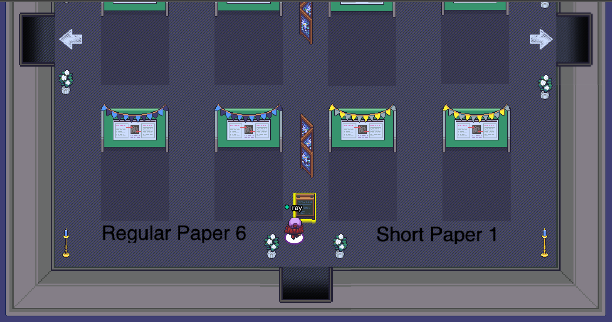
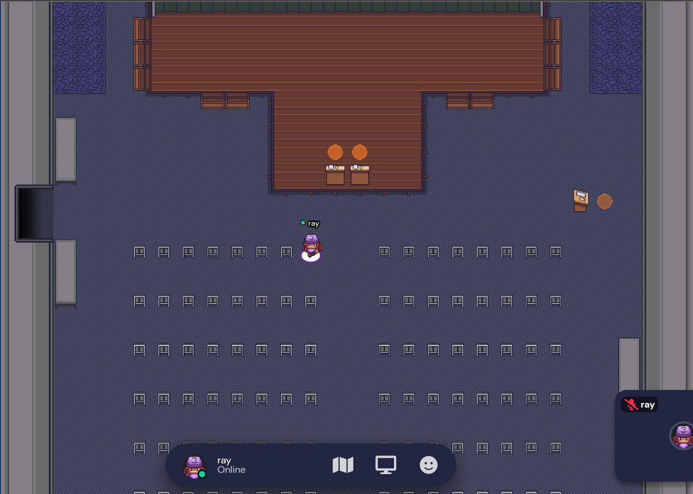

## For audience
Pre-recorded presentations of all accepted papers will be available in the program during the conference period. Audience are welcome to ask questions in running sessions or when joining the session of “Social Connections on Gather.Town”. 

Map of Virtual Rooms on Gather.Town can **[*be found here*](https://mmasia2021.uqcloud.net//gather-town-map)**.

## For presenters

### Regular, Grand Challenge, Applied Research Tracks

- Authors are required to attend your scheduled sessions on **Webinar** for live Q&As right after each presentation.
- Authors are required to attend “Social Connections on Gather.Town” session in **Gather.Town** on Day 2 for live Q&As. Please find your poster, stand in front of it, and wait for others to come over for discussions in the Poster Rooms (see the example below). You are suggested to use “Author of $modelname: $yourname” as the ID for being recognised by other attendees.

    

### Short Paper, Demo, Brave New Ideas Tracks
- Authors are required to attend your scheduled sessions (i.e., Lightning Talk Session 1 on Day 1 and Lightning Talk Session 2 on Day 2) in **Gather.Town** (Exhibition Hall) and prepare to answer questions raised by the audience during playing your presentations. Please sit at front rows as ray did in the example below.
- Authors are required to attend “Social Connections on Gather.Town” session in **Gather.Town** for live Q&As. Please find your poster, stand in front of it, and wait for others to come over for discussions in the Poster Rooms. You are suggested to use “Author of $modelname: $yourname” as the ID for being recognised by other attendees.

    

### Workshops
- Authors are required to attend your scheduled sessions in **Gather.Town** for live Q&As right after each presentation. 
- Authors are required to attend “Social Connections on Gather.Town” session in **Gather.Town** on Day 2 for live Q&As. Please find your poster, stand in front of it, and wait for others to come over for discussions in the Poster Rooms. You are suggested to use “Author of $modelname: $yourname” as the ID for being recognised by other attendees.
