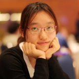
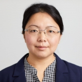

The SIGMM EC has decided on a **[*"25 in 25"*](https://records.sigmm.org/2019/10/21/introducing-the-new-role-of-the-director-of-diversity-and-outreach/)** strategy to strategically increase the participation of women in SIGMM and all its activities. This strategy aims at increasing the participation of women in all activities and committees of SIGMM to at least 25% by 2025.

ACM Multimedia Asia 2021 is advocating for a better engagement and involvement of female researchers in all sorts of activities in Multimedia Asia and beyond. The Roundtable (scheduled on Day 2) invites six female panellists at different career stages to share their experiences at being a researcher and educator in multimedia. It will also be an event where participants, both women and men can meet up and exchange ideas.

---

    

        
    

    <!-- - **Title**: -->
    <h3 class="name">Si Liu</h3>
    <!-- - **Date**: -->
    <!-- - **Abstract**:  -->
    
Beihang University

    

        Dr. Si Liu is the leader of the CoLab and an associate professor in Beihang University. She was a visiting professor in Microsoft Research Asia. She used to work with Prof. Shuicheng Yan in National University of Singapore. She obtained Ph.D. degree from Institute of Automation, Chinese Academy of Sciences (CASIA), under the supervision of Prof. Hanqing Lu. She obtained Bachelor degree from Advanced Class of Beijing Institute of Technology (BIT).
    

---

    

        
    

    <!-- - **Title**: -->
    <h3 class="name">Lina Yao</h3>
    <!-- - **Date**: -->
    <!-- - **Abstract**:  -->
    
University of New South Wales

    

        Lina Yao is an Associate Professor at School of Computer Science and Engineering at the University of New South Wales (UNSW), Australia. Her research interest lies in machine learning, and its applications in recommender systems, activity modeling and prediction, the Internet of Things, and Brain-Computer Interface. She is serving as the Associate Editor for ACM Transactions on Sensor Networks (ACM TOSN) and Knowledge-based Systems (KNOSYS).
    

---

    

        
    

    <!-- - **Title**: -->
    <h3 class="name">Lianli Gao</h3>
    <!-- - **Date**: -->
    <!-- - **Abstract**:  -->
    
University of Electronic Science and Technology of China

    

        Dr. Lianli Gao is a Professor at School of Computer Science and Engineering, UESTC. She is a member of the CFM Lab. She obtained her PhD degree in Information Technology from The University of Queensland (UQ), Australia, under the supervision of  Prof. Jane Hunter and Prof. Michael Bruenig. She received her BS degree in Computer Science from UESTC, in 2009. 
        Her research ranges from Semantic Web, Machine Learning, Deep Learning, Computer Vision (Images and Videos), NLP, Knowledge Reasoning, Knowledge and the related practical applications etc. Specifically, she is mainly focusing on integrating Natural Language for Visual Content Understanding. 
    

---

    

    
    

    <!-- - **Title**: -->
    <h3 class="name">Mahsa Baktashmotlagh</h3>
    <!-- - **Date**: -->
    <!-- - **Abstract**:  -->
    
The University of Queensland

    

        Mahsa Baktashmotlagh is currently a Lecturer at UQ with a research focus, developing machine learning and datamining techniques applied in: Visual data analysis (Visual domain adaptation, video classification, and animal’s foragingbehavioural analysis), Road traffic networks (Mining large scale road traffic networks and building a road loadbalancing tool to predict congestion on any road in the city) , Biomedical data (Prediction of neonatal sepsis), and Finance (Hedging foreign exchange trading risks).
    

---

    

    
    

    <!-- - **Title**: -->
    <h3 class="name">Ran Yi</h3>
    <!-- - **Date**: -->
    <!-- - **Abstract**:  -->
    
Shanghai Jiao Tong University

    

        Ran Yi is an Assistant Professor at Shanghai Jiao Tong University (SJTU). She is a member of SJTU Digital Media and Computer Vision Laboratory. She received her Ph.D. degree from CSCG Group, Tsinghua University in 2021, advised by Prof. Yong-Jin Liu. She also closely collaborates with Prof. Yu-Kun Lai, Prof. Paul L. Rosin and Prof. Ying He.
    

